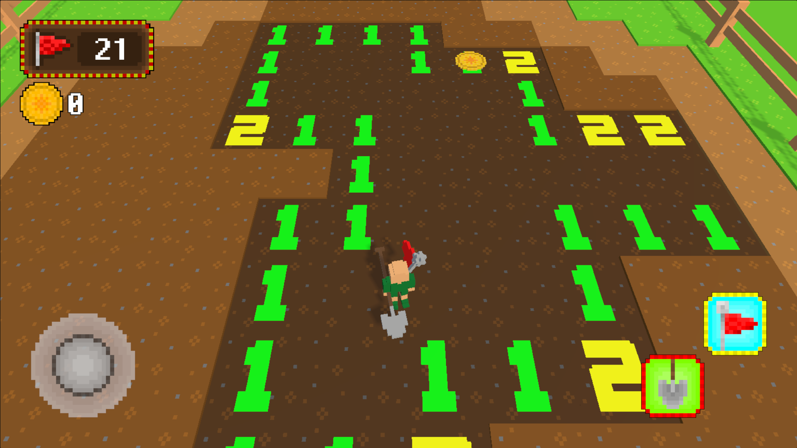

# Treasure Sweeper
CMP6187 Mobile Game Development Project

**The Proposed Idea**

IDEA: 

Minesweeper based in 3D environment. It icludes small, custom built levels that act as collectables. This will create game progression.

PLATFORM: 

The game will be made in Unity Game Engine for Androids

VISUALS:

The Models will be very low poly, Voxel Art.

MECHANICS:
* Player Controller with joystick for movement and 2 inputs for dig tile and flag.
* Cinemachine for isometric camera.
* Gyro (Input.Acceleration) for looking around.
* Vibration for deaths, buttons, other.
* 3 type of ads: reward, banner and interstitial.
* Multiple Levels (5 Currently)
* Settings
* PlayerPref saving system.
* Loading Screen
* Most Minesweeper game features.

FEATURES MISSING:
* Advanced Mine Unlocking Feature.
* Powerups or scrolls that unlock specific numbers.
* Character Customs
* normal Sweeper gamemode.
* better Shaders.
* In-Game Store.
* Better Optimizations.

**Project Management**

All assets where own created. Other assets are free use only. No copy right issues.

TOOLS:
* PiskelApp
* Blender
* MagicaVoxel
* GitHub
* Unity
* YouTube
* VegasPro

Currently, the game is on Itch.io

https://elliot-greenwood.itch.io/treasure-sweeper
